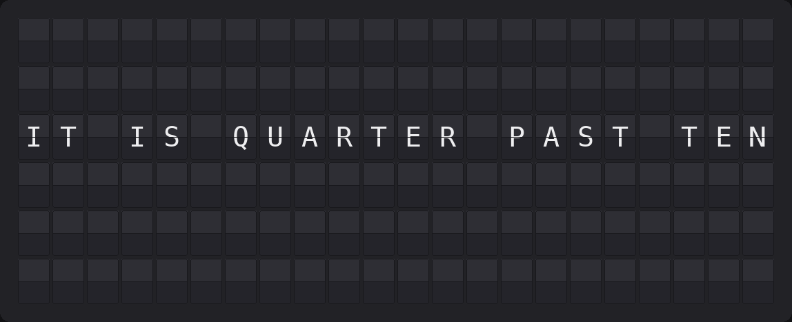
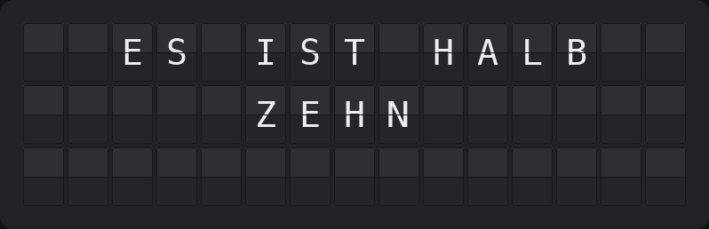
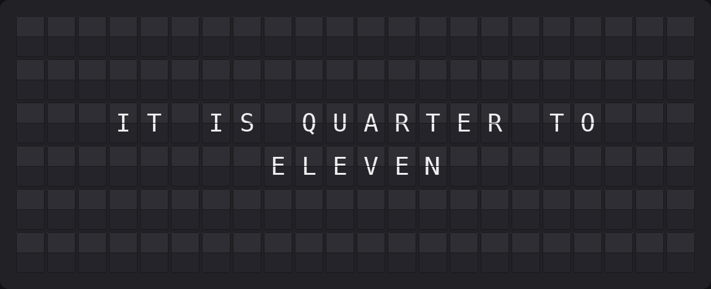
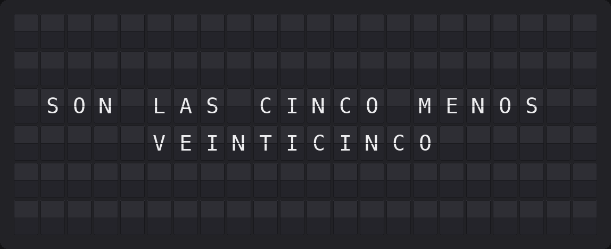
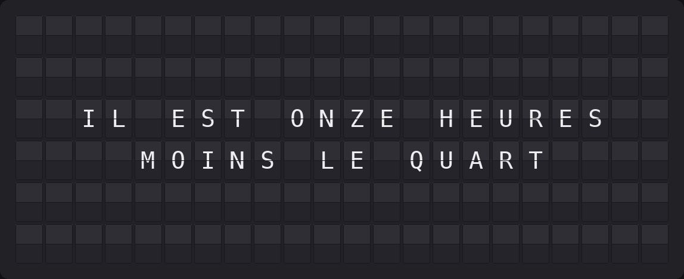
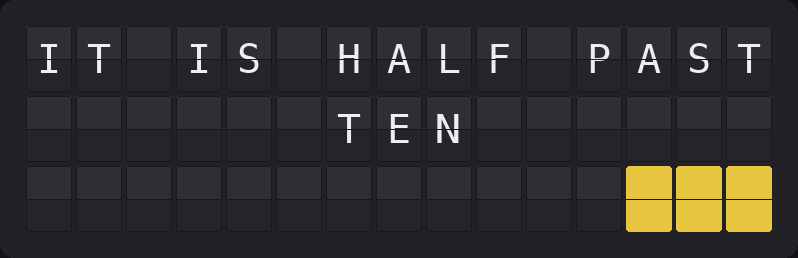

# Word Clock Plugin

Tell the time in words the way a QLOCKTWO does — in German, English, Spanish or French, sized to the board it renders on.



**→ [Setup Guide](./docs/SETUP.md)**

## Overview

A physical word clock lights letters inside a fixed matrix. A split-flap has no dim state, so this plugin renders only the words that would be lit — which is what the matrix visually reduces to anyway — and lays them out for the board it is rendering on.

The phrase moves in five-minute steps (`ES IST VIERTEL NACH ZEHN`, `IT IS QUARTER PAST TEN`, `SON LAS ONCE MENOS CUARTO`, `IL EST ONZE HEURES MOINS LE QUART`). Every phrase in all four languages fits a Note (15×3) as well as a Flagship (22×6); the plugin reads `self.board` at render time and re-wraps accordingly, so one page works on both.



## Template Variables

### Phrase

| Variable | Description | Example |
|----------|-------------|---------|
| `{{word_clock.phrase}}` | Full spelled-out time including the prefix | `ES IST VIERTEL NACH ZEHN` |
| `{{word_clock.phrase_short}}` | Same, without the prefix | `VIERTEL NACH ZEHN` |
| `{{word_clock.prefix}}` | The opener, empty when disabled. Spanish agrees it with the hour | `ES IST` |

### Board Lines

| Variable | Description | Example |
|----------|-------------|---------|
| `{{word_clock.block}}` | The whole laid-out board as one value, rows separated by newlines | `` ES IST VIERTEL NACH ␤        ZEHN`` |
| `{{word_clock.line1}}` … `{{word_clock.line6}}` | The same rows individually, each padded to the board width. Rows past the board's height are empty. | `         ZEHN         ` |

### Details

| Variable | Description | Example |
|----------|-------------|---------|
| `{{word_clock.hour_word}}` | The hour the phrase names, spelled out | `ZEHN` |
| `{{word_clock.time}}` | Exact time behind the phrase | `10:17` |
| `{{word_clock.step}}` | Five-minute step the phrase represents | `15` |
| `{{word_clock.minute_offset}}` | Minutes past that step (0–4) | `2` |
| `{{word_clock.minute_dots}}` | Color tiles for the offset, empty unless minute dots are on | `{69}{69}` |
| `{{word_clock.language}}` | Active language code (`de`, `en`, `es`, `fr`) | `de` |

## Example Templates

The plugin already lays itself out for the board, so the simplest setup is a **single-plugin page** with no template at all — it fills the board directly, centered.

Inside a template page, put `block` on the **first** line and leave the rest empty. FiestaBoard splits a value containing newlines across the board rows, so this reproduces the same centered layout:

```
{{word_clock.block}}


```

The rows come out padded to the full board width, so the page's own alignment setting leaves them untouched — horizontal placement stays with the plugin's **Alignment** option, vertical centering is handled for you.

To place the clock in one specific row instead, use a line variable:

```
{{date_time.date_pretty}}
{{word_clock.line3}}
```

### Don't do this

```
{{word_clock.phrase}}
```

`phrase` is a single string. On a plain line the board cuts it off at the edge — `ES IST FUENF NACH HALB ZWOELF` loses `ZWOELF`. If you want the raw phrase anyway, switch the line to **wrap** in the page editor and leave the lines below it empty; it will then flow across them, though the block sits at the top of the board rather than centered.







## Configuration

| Setting | Type | Default | Description |
|---------|------|---------|-------------|
| `enabled` | boolean | `false` | Enable the plugin |
| `language` | `de` \| `en` \| `es` \| `fr` | `de` | Language the time is spelled out in |
| `timezone` | string | `Europe/Berlin` | IANA timezone; falls back to the FiestaBoard timezone when empty |
| `show_prefix` | boolean | `true` | Show `ES IST` / `IT IS` / `SON LAS` / `IL EST`. Dropped automatically if the phrase would not fit |
| `german_style` | `standard` \| `regional` | `standard` | `VIERTEL NACH ZEHN` vs. `VIERTEL ELF`. German only |
| `umlauts` | `expand` \| `strip` | `expand` | `FUENF`/`ZWOELF` vs. `FUNF`/`ZWOLF` — the board has no umlaut tiles. German only |
| `rounding` | `down` \| `nearest` | `down` | `down` matches a physical word clock |
| `alignment` | `center` \| `left` | `center` | Horizontal alignment of each row |
| `show_minute_dots` | boolean | `false` | Corner dots for the minutes the words cannot express |
| `dot_color` | color name | `white` | Tile color used for the minute dots |

No API key, no network access, no environment variables.

## Features

- German, English, Spanish and French, switchable per board
- `ES LA UNA` vs. `SON LAS DOS` — Spanish agrees the copula with the hour the phrase names, not the hour on the clock
- `IL EST MIDI`, `IL EST MINUIT`, `UNE HEURE` vs. `DEUX HEURES` — French never says "douze heures"
- Standard German (`VIERTEL NACH ZEHN`) and the regional East German / Franconian / Saxon counting (`VIERTEL ELF`, `DREIVIERTEL ELF`)
- `EIN UHR` vs. `FUENF NACH EINS` — the German hour keeps its `S` everywhere except before `UHR`
- Board-adaptive layout: every phrase fits a Note (15×3) and a Flagship (22×6), verified by a test that walks all 24 hours × 12 steps × every language and option combination. French is the tight one at 37 characters (`IL EST QUATRE HEURES MOINS VINGT-CINQ`)
- Umlaut handling for a charset that has none
- QLOCKTWO-style minute dots as colored tiles, skipped when the bottom row is full



- `live_data`, so the board never shows a cached time
- No network calls, so nothing to rate-limit and nothing to leak

## Development

The plugin imports `src.plugins.base` from the FiestaBoard core, so tests need the core repo checked out next to this one:

```bash
git clone https://github.com/Fiestaboard/FiestaBoard.git ../FiestaBoard

# Import paths matching how FiestaBoard loads the plugin
mkdir -p plugins && touch plugins/__init__.py
ln -sfn .. plugins/word_clock

python -m venv .venv && .venv/bin/pip install pytest pytest-cov
PYTHONPATH=".:../FiestaBoard" .venv/bin/pytest tests/ --cov=. --cov-report=term-missing
```

## Author

Oliver Rummeyer
